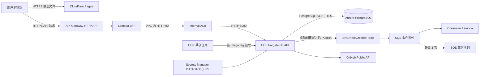
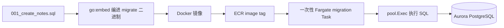

# AWS 架构设计说明

## 1. 设计目标

这个项目是一个前后端分离的 Go 应用：

- 静态前端由 Cloudflare Pages 托管。
- Go API 运行在 ECS Fargate。
- 留言数据保存在 Aurora PostgreSQL。
- pull request 可以获得独立的后端 Preview。
- production 和 Preview 复用账号里已有的 AWS 网络与容器基础设施，避免重复创建 ALB、NAT Gateway、ECR 和 ECS Cluster。

当前生产页面和 API：

```text
Pages:   https://yy-aws-setting.pages.dev
API:     https://96r1jv57ee.execute-api.ap-northeast-1.amazonaws.com/yy-aws-setting
```

## 2. 整体请求链路



请求示例：

```text
浏览器请求：
GET /yy-aws-setting/api/notes

API Gateway：
把请求交给 Lambda BFF

Lambda BFF：
把原始 method、path、query、headers、body 转发到 internal ALB

ALB：
匹配 /yy-aws-setting/*，去掉 /yy-aws-setting 前缀

Go ECS 最终收到：
GET /api/notes
```

## 3. 每一层为什么存在

### 3.1 Cloudflare Pages

Pages 只负责 HTML、CSS、JavaScript、HTTPS 和静态资源缓存。浏览器执行 `frontend/app.js` 后，直接请求 API Gateway；Pages 本身不会进入 AWS VPC，也不能直接访问 internal ALB。

### 3.2 API Gateway

API Gateway 是公开 HTTPS 入口，提供 AWS 管理的域名与证书，因此当前架构不需要 ACM。

它负责：

- 接收公网 HTTP 请求。
- 根据 route 把请求交给 Lambda BFF。
- 统一处理当前 API 的 CORS。
- 提供可配置的限流、认证、日志等入口能力。

### 3.3 Lambda BFF

BFF 是 Backend For Frontend。当前 Lambda 位于 VPC 私有子网中，因此它既能接收 API Gateway 事件，又能访问只有私有地址的 ALB。

它当前主要负责：

1. 把 API Gateway event 转换成普通 HTTP 请求。
2. 保留 method、path、query、headers 和 body。
3. 调用 `PROFILE_GO_BASE_URL=http://internal-...elb.amazonaws.com`。
4. 把 ALB 响应转换回 API Gateway 响应。

Lambda BFF **不是天然的高并发防火墙**。API Gateway 和 Lambda 都能快速扩容，如果不限制，反而可能同时向下游 ALB/ECS 发出大量请求。

需要保护 ECS 时，应明确配置：

- API Gateway route/stage throttling。
- Lambda reserved concurrency，限制同时转发给下游的请求数。
- AWS WAF、鉴权和请求大小限制。
- ECS Service Auto Scaling。
- Go API 自身的超时、连接池和限流。

当前 BFF 更核心的价值是“公网事件到 VPC 私有 HTTP 的网络桥接和协议适配”。如果完全不需要 BFF 业务逻辑，也可以使用 API Gateway VPC Link 直接私有集成 ALB，从而减少一次 Lambda 转发。

### 3.4 internal ALB

ALB 没有公网 IP，只接受 Lambda BFF Security Group 的 HTTP 80 流量。它复用一个 Listener，通过 path rule 把流量分给不同 Target Group：

```text
/profile/*                               → 原 profile-go
/yy-aws-setting/*                        → production
/yy-aws-setting-preview/<preview-name>/* → 对应 PR Preview
```

ALB 还负责 `/health` 健康检查，只把流量发送给健康的 Fargate Task。

### 3.5 ECS Fargate

每个环境使用独立的：

- Task Definition revision
- ECS Service
- Target Group
- ALB Listener Rule
- ECR image tag

Fargate Task 没有公网 IP，运行在带 NAT 出口的私有子网。它通过 Security Group 访问 Aurora 5432，通过 NAT访问 GitHub API和其他公网依赖。

### 3.6 Aurora 与 Secrets Manager

Aurora 是 PostgreSQL 兼容数据库。Go 使用 `pgxpool` 建立连接池，连接信息来自现有 Secret 的 `DATABASE_URL`，代码会补充：

```text
sslmode=verify-full
sslrootcert=/app/global-bundle.pem
```

数据库密码不会写进 GitHub、Docker 镜像或 CloudFormation 模板。

## 4. CDK Stack 的分工

### YyAwsSettingFoundation

[`foundation-stack.ts`](../infra/lib/foundation-stack.ts) 不重新创建 ALB、ECR、Cluster、VPC 或 Aurora。它导入这些已有资源，创建当前项目自己的 Lambda BFF、Version、`live` Alias、CodeDeploy Deployment Group，并给现有 API Gateway 增加：

```text
ANY /yy-aws-setting/{proxy+}
ANY /yy-aws-setting-preview/{proxy+}
```

Foundation 长期保留，多次 deploy 是幂等的。

### YyAwsSettingMessaging

[`messaging-stack.ts`](../infra/lib/messaging-stack.ts) 创建 `NoteCreated` Topic、主队列、Consumer Lambda、DLQ 和 DLQ Alarm。production 与 Preview 的 ECS Task 共用 Topic，但事件中的 `environment` 字段会标记来源。

### YyAwsSettingMonitoring

[`monitoring-stack.ts`](../infra/lib/monitoring-stack.ts) 定义每 5 分钟一次的 CloudWatch Synthetics 巡检和失败 Alarm。当前教学账号将 Lambda 内存限制为最多 512 MiB，而 AWS 新建 Canary 要求至少 960 MiB，因此这个 Stack 默认关闭。账号限制解除后执行：

```bash
cd infra
npx cdk deploy YyAwsSettingMonitoring --require-approval never -c enableSynthetics=true
```

默认关闭是账号限制的部署适配，不是删除作业实现。

### YyAwsSettingProduction / YyAwsSettingPr-<number>

[`application-stack.ts`](../infra/lib/application-stack.ts) 为一个具体环境创建 ECS Service、Task Definition、Target Group 和 ALB Rule。

删除 PR Stack 不会删除共享 ECR、Cluster、ALB、BFF、Aurora，也不会影响 production 或其他 PR。

## 5. SQL migration 到 Aurora 的完整过程

SQL 文件不是由 GitHub 直接“上传进数据库”。它经过下面这条链路：



关键代码分为四处：

1. [`database.go`](../internal/database/database.go) 把 SQL 编译进 Go 二进制：

   ```go
   //go:embed migrations/*.sql
   var migrations embed.FS
   ```

2. `Migrate()` 读取 SQL：

   ```go
   data, err := migrations.ReadFile("migrations/001_create_notes.sql")
   ```

3. **真正把 SQL 发给 Aurora 执行的关键语句**：

   ```go
   _, err := pool.Exec(ctx, string(data))
   ```

4. [`cmd/migrate/main.go`](../cmd/migrate/main.go) 调用 `database.Migrate()`；[`run-ecs-migration.sh`](../.github/scripts/run-ecs-migration.sh) 启动一次性 ECS Task，并把容器命令覆盖为：

   ```text
   /app/migrate
   ```

因此，如果只问“主要是哪句话把 SQL 写进 Aurora”，答案就是：

```go
pool.Exec(ctx, string(data))
```

但它能在线上执行的前提是：SQL 已嵌入镜像、镜像已推到 ECR、migration Task 拿到了 Secret 和私有网络。

当前 `Migrate()` 只显式读取 `001_create_notes.sql`。新增 `002_*.sql` 后还需要更新执行逻辑；更正式的项目建议使用 goose、golang-migrate 或 Atlas记录迁移版本。

## 6. Preview 和 production 不是一个 PR 的两个状态

`preview` 和 `production` 是 GitHub Environments，也是两条不同生命周期的部署目标：

| 对比 | preview | production |
|---|---|---|
| 触发条件 | PR opened/synchronize/reopened | push 到 main 或手动触发 |
| 代码来源 | PR head commit | main commit |
| 生命周期 | PR 存在期间临时运行 | 长期运行 |
| ECS Service | 每个 PR 独立 | 固定一个 production |
| URL | 带 PR/分支前缀 | 固定 `/yy-aws-setting` |
| Secrets/权限 | preview Environment | production Environment |
| 审批 | 通常自动 | 可配置 Required reviewers |
| 清理 | PR close 自动 destroy | 不自动删除 |

一个 PR 正常只部署到 preview；合并进 main 后，相同代码才通过 production workflow 部署到 production。

### 对每个开发者的好处

- 开发者 A 和 B 可以同时部署不同分支，不互相覆盖。
- 每个人都能把独立 Preview URL 发给评审或测试人员。
- 在合并前发现容器启动、健康检查、网络、Secret 和数据库兼容问题。
- production 凭证可以增加审批保护，不必暴露给普通 PR job。

### 对每个 PR 的好处

- PR commit 与实际运行镜像 Tag 一一对应。
- 新 commit 推送后，旧的同 PR workflow 会被 concurrency 取消，减少浪费。
- PR close 自动删除临时 ECS Service、Target Group 和 Rule。
- PR 合并前不会覆盖稳定 production。

### 当前共享数据库的限制

Preview ECS 是隔离的，但 Aurora 仍与 production 共享。因此 migration 必须向后兼容，不能在 PR 中直接删除 production 仍依赖的列或表。要求完全隔离时，需要为 Preview 使用独立 schema、独立 database 或临时数据库实例。

## 7. 部署链路

### PR workflow

```text
Jira Guard + DB Guard
        ↓
Go test / TypeScript build
        ↓
构建镜像并以 pr-<number>-<sha> 推到共享 ECR
        ↓
部署 YyAwsSettingPr-<number>
        ↓
如有 migration 变更，运行一次性 migration Task
        ↓
评论 Preview URL
```

### production workflow

```text
push main
   ↓
Go test / TypeScript build
   ↓
幂等部署 Foundation
   ↓
以完整 Git SHA 构建并推送镜像
   ↓
部署 YyAwsSettingProduction
   ↓
需要时执行 migration Task
```

## 8. 主要风险与后续改进

- Lambda BFF 当前没有 reserved concurrency，不能把它当作下游过载保护。
- Preview 与 production 共享 Aurora，需要严格使用向后兼容 migration。
- GitHub 长期 Access Key 应使用专用 IAM 用户并定期轮换；长期更推荐 OIDC 临时凭证。
- production Fargate 常驻 Task 有持续费用；PR Preview 存活期间也会产生 Fargate 费用。
- 当前 migration 没有版本表，后续应引入专用 migration 工具。

## 9. CloudWatch Synthetics 巡检

### `/health` 本身不是巡检任务

```go
mux.HandleFunc("GET /health", api.health)
```

这行代码只是注册一个可被调用的健康接口。ALB 或 Synthetics 调用它时才发生一次检查。真正的“巡检”还必须包含定时执行、HTTP 请求、结果断言、指标、日志和告警。

[`monitoring-stack.ts`](../infra/lib/monitoring-stack.ts) 的 `canaryScript` 做了这些事情：

1. 请求 production `/health`，要求 HTTP 200、`status=ok`、`database=connected`。
2. 请求 `/api/notes`，要求 HTTP 200 且 JSON 是数组。
3. 单次请求 10 秒超时，整个运行 1 分钟超时。
4. 任一断言失败就抛错，由 Synthetics 写入失败指标和运行日志。
5. Alarm 读取 SuccessPercent；启用后还可成为 BFF CodeDeploy 的回滚信号。

脚本内容看起来比一个 URL 多，是因为它不是只判断“能不能连通”，还判断响应内容是否真的正确。

### 如果在 AWS 网页创建

CloudWatch → Synthetics Canaries → Create canary：

- Blueprint：`API canary` 或 `Heartbeat monitoring`；要同时检查两个接口时选择自定义脚本。
- Name：`yy-aws-setting-api`
- Runtime：东京区当前可用的 `syn-nodejs-puppeteer-16.1`
- Memory：960 MiB
- Timeout：60 秒
- Schedule：每 5 分钟持续运行
- Endpoint：`https://96r1jv57ee.execute-api.ap-northeast-1.amazonaws.com/yy-aws-setting/health`
- Artifacts：私有、加密 S3 Bucket，生命周期 30 天
- IAM Role：创建专用 Canary Role
- VPC：不选；被测 API Gateway 是公网入口
- Data retention：成功 7 天、失败 14 天

只用 Heartbeat 可以检查一个 URL，但不能完成文档中的两次 JSON 断言；控制台要达到相同效果，也需要粘贴与 `canaryScript` 等价的代码，并不比 CDK 更简单。

当前账号无论网页还是 CDK 都会失败，已实际得到两条互相冲突的服务约束：Synthetics 要求内存至少 960 MiB，而账号中的 Lambda 上限为 512 MiB。需要管理员解除账号限制后再启用。

## 10. Lambda BFF 灰度发布

V1、V2、V3 不是三个源文件，都是 [`infra/lambda/bff/index.mjs`](../infra/lambda/bff/index.mjs) 的不可变发布快照。代码或 Lambda 配置变化后，CDK 发布一个新 Version；`live` Alias 是 API Gateway 永远调用的稳定入口。

本次实际验证过程：

```text
Version 1 / BFF_RELEASE=v1：作为基线，live → 1
Version 2 / BFF_RELEASE=v2：CodeDeploy 先切 10%，观察 5 分钟，再切 100%
Deployment d-7F1RIVMCK：Succeeded
Version 3 / BFF_RELEASE=v3：最终源码再次执行相同灰度
Deployment d-OVBXSEMCK：Succeeded
最终 live → 3
```

本次“发布 V3”就是修改 `index.mjs` 或 Lambda 配置后再次 deploy，AWS 生成下一个 Version；它并不对应 `v3.js`。以后发布下一版时同理传入新的 release 标记：

```bash
cd infra
npx cdk deploy YyAwsSettingFoundation --require-approval never -c bffRelease=v4
```

`CANARY_10PERCENT_5MINUTES` 的准确含义是：新 Version 先接收约 10% 的 Alias 调用，旧 Version 接收约 90%；5 分钟内 Alarm 未触发后，新 Version 升到 100%。它与 CloudWatch Synthetics 的 Canary 名字相似，但不是同一个功能。

## 11. SNS、SQS 与 DLQ

SQS 不会自动接住所有大量 API 请求。当前业务只在 `POST /api/notes` 成功写入 Aurora 后发布一条事件：

```text
浏览器 POST
  → Go INSERT ... RETURNING（Aurora 已提交）
  → SNS Publish NoteCreated
  → SNS Subscription 投递到 SQS
  → Consumer Lambda 批量读取并处理
  → 连续失败 3 次才进入 DLQ
```

事件包含 `eventId`、`eventType`、`noteId`、`content`、`createdAt` 和 `environment`。GET、`/health` 以及任意大流量请求都不会进入该队列。如果希望用队列削峰，必须把具体写操作设计为异步接口：API 先入队并返回 202，Worker 再处理；那是另一种业务语义。

真正连接 Go 和 SNS 的配置在 [`application-stack.ts`](../infra/lib/application-stack.ts)：

```text
NOTE_EVENTS_TOPIC_ARN=<Topic ARN>
Task Role: 仅允许 sns:Publish 到该 Topic
```

发布代码在 [`publisher.go`](../internal/messaging/publisher.go)，调用位置在 [`api.go`](../internal/httpapi/api.go) 的 Aurora INSERT 成功之后。SNS 发布失败会记录错误，但不会把已经写入数据库的 201 改成失败；正式系统若要求绝不丢事件，应进一步采用 Transactional Outbox。

### 集成测试文件

```bash
# 正常 SNS → SQS → Consumer Lambda
bash .github/scripts/test-messaging-normal.sh

# 故意失败 3 次并进入 DLQ；会触发 Alarm，必须显式确认
CONFIRM_DLQ_TEST=yes bash .github/scripts/test-messaging-dlq.sh

# 账号限制解除并部署 Canary 后，主动运行一次巡检
bash .github/scripts/test-synthetics.sh
```

DLQ 测试完成并截图取证后应删除测试消息，否则 CloudWatch Alarm 持续为 ALARM。本次测试产生的唯一一条 DLQ 消息已清理，队列已恢复为 0。
